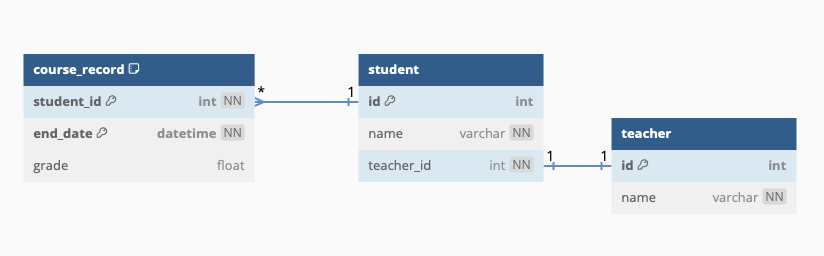

# Submission for GovTech's 2025 Product Operations Tooling Internship

## Explanation of decisions

1. Python makes the most sense to me, because it has great support for data analysis and processing with libraries like pandas -- something which may be required in a future update to this web service
2. FastAPI as my backend service because it supports input validation and has auto-generated documetation for its endpoints
3. Used an ORM instead of raw SQL queries because
   - Gives me a single source of truth for database tables
   - I am a huge fan of typing support
   - Based on what I have read online, I believe the biggest drawback of ORMs is that they cannot handle complex queries well. If performance really becomes an issue in the future, I would then convert the queries to raw SQL. I don't think there is a need to optimize for that yet
4. Choice of SQLModel as the ORM
   - Native support for FastAPI type validation, so I dont have to maintian 2 copies of types (which seems to be the suggested approach for using SQLAlchemy and FastAPI)
   - If there is a need to add in more complex queries, it helps that SQLModel is built on top of SQLAlchemy. This enables me to tap on SQLAlchemy functionalities if need be
5. Store end_date instead of start_date in the course_record table to:
   - reduce data redundancy: you can always find start_date, given an end_date, so there is no need to add another column
   - searches are currently made by end_date, so storing end_date better supports the queries that I will make
   - end_date is known once the course record is made

## In creating this backend service, here are the assumptions I have made:

1. Semester start and end times:
   - Sem 1: Aug 1 to Nov 1
   - Sem 2: Jan 1 to April 1
2. Each semester, the single course that the students take are the same. Changing their teacher only changes the teacher they are taking the class from.
3. Each student only receives their GPA for that semester at the end of the semester

### DB Diagram

